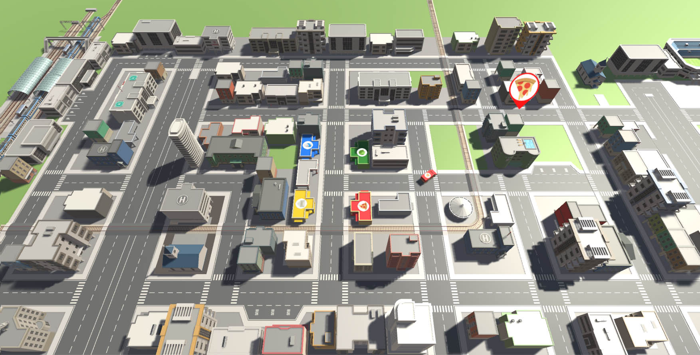
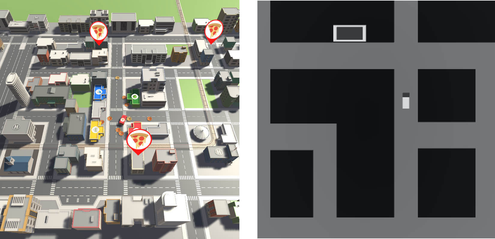

# Deep Reinforcement Learning of an Agent in a Modern 3D Video Game
This repository provides access to all material necessary to reproduce the results of our paper on Deep Reinforcement Learning applied to a modern 3D video-game. The video-game used in our experiments is a 3D local-multiplayer game developed using the Unity game-engine and is called Delivery Duel. We evaluated the impact on learning performance of different modifications to the environment by applying two recent deep reinforcement learning algorithms, namely DQN (with various extensions) and A2C.

## Data included in this repository:
 - The research paper and poster this repository represents ([research/](research/))
 - Raw reproducible results of our research ([results/](results/))
 - Source code of the frameworks in the state they were used in our work, including some modifications / extensions ([frameworks/](frameworks/))
 - Built instances of Delivery Duel necessary to reproduce our results and which can be used for future work ([deliveryduel/](deliveryduel/))

## Delivery Duel

In Delivery Duel the player / agent controls a delivery van. The agent's goal is to deliver pizzas to target locations in an urban environment. The entire scene is rendered from an approximately 75° top-down perspective. Delivery destinations are highlighted above the corresponding building by a big circular marker. The agent completes a delivery by conducting a throw action in the correct direction and hitting the destination building. After a delivery, the agent has to return to its base, located in the middle of the city, before a new destination is highlighted. The agent's score is increased for delivering items, proportional to how fast the item was delivered, and for returning to the base.

While Delivery Duel offers local-multiplayer capability for up to four players, our experiments for solely conducted on the singleplayer mode.

### Optional Environment Modifications
There are three optional environment modifications, which can be turned off or on, resulting in eight possible configurations:
 - Environment Representation: Complex 3D render-mode or Simple 2D render-mode
 - Agent Motion Control: Physics-based movement or completely linear movement
 - Reward Signal: In-game score (very sparse) or more continuous reward (also taking distance to target into account)

These three modifications are often abbreviated as 3D / 2D, Phys / Lin, Non-Cont / Cont.

When using the [run_baselines](frameworks/ml-agents/python/run_baselines.py) script for running experiments, you can use the optional commandline argument `--unity-arguments "<additional arguments>"` to pass commandline arguments to the unity process. The following unity arguments can be set to turn these optional modifications on or off:
 - `--render-mode`: `complex` or `simple`
 - `--motion-control`: `physical` or `linear`
 - `--reward-signal`: `sparse` or `cont`
 
For instance, a dqn test-run using the complex render-mode, linear motion control and a continuous reward signal can be executed by running:

`python run_baselines.py <path_to_deliveryduel_build> --method dqn --unity_arguments "--render-mode complex --motion-control linear --reward-signal cont"`

### Delivery Duel Credits
Delivery Duel was developed by Samuel Arzt, Katrin-Anna Zibuschka and Lukas Machegger, who approved to make the game publicly available for scientific purposes.
The icons for delivery items were used under the [CC3 License](https://creativecommons.org/licenses/by/3.0/), with attribution to the following authors:
 - Pizza Icon: Designed by [freepik](https://www.flaticon.com/authors/freepik) from Flaticon.
 - Cabbage, Mail, Milk and Notepad Icon: Designed by [madebyoliver](https://www.flaticon.com/authors/madebyoliver) from Flaticon.

## Frameworks
In order to train Deep Reinforcement Learning agents on this novel environment, three different frameworks were combined:
 - [OpenAI Gym](https://github.com/openai/gym)
 - [OpenAI Baselines](https://github.com/openai/baselines)
 - [Unity ML-Agents](https://github.com/Unity-Technologies/ml-agents)

Baselines provides open-source Python implementations of popular RL algorithms. Gym defines an open-source Python interface for agent environments. ML-Agents extends the Unity engine with an interface for testing AI algorithms on existing Unity games by offering an API which connects Unity with Python. Please see each individual framework's license file included in their respective subdirectory for license information of each framework.

Please refer to the individual repositories of the frameworks for an installation guide.

The source code of these frameworks in the state they were used for our paper is also included in this repository (see [frameworks/](frameworks/)). The code of Baselines and ML-Agents was slightly modified / extended to fit our needs. In order to train a reinforcement learning agent in a Unity game environment using the algorithms provided by Baselines, the ML-Agents environment was wrapped to function as a Gym environment.

The wrappers used for training a ML-Agents environment using Baselines can be found in [frameworks/ml-agents/python/baselines_wrapper.py](frameworks/ml-agents/python/baselines_wrapper.py). The code used for executing the test-runs of our paper can be found in [frameworks/ml-agents/python/run_baselines.py](frameworks/ml-agents/python/run_baselines.py).

